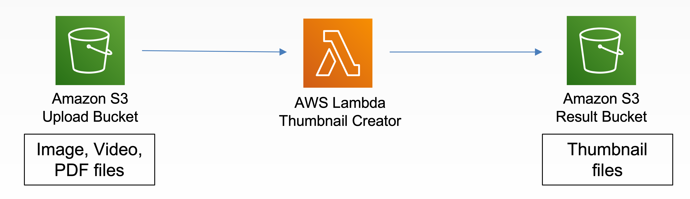
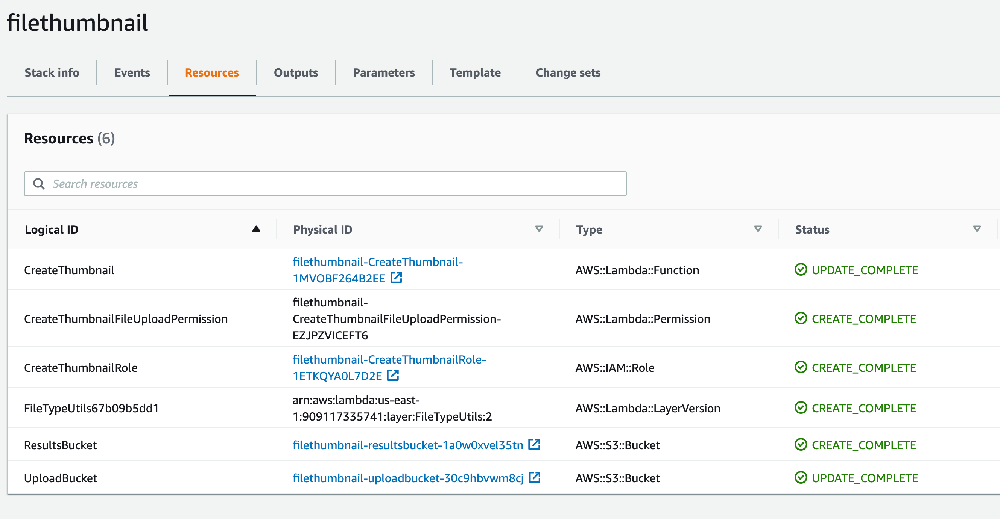

# Thumbnail Creator

This project contains source code and supporting files for a serverless application - Thumbnail Creator. This application creates a thumbnail for image, pdf, and video files once uploaded into an S3 bucket. See [Usage](##usage) section.

The application uses several AWS services including a Lambda function and S3 buckets with three custom Lambda Layers. These resources are defined in the `template.yaml` file in this project. You can update the template, e.g., change parameters' `Default` value and update your application.

## Architecture

1. Upload image, video, or pdf file to the S3 upload bucket
2. Thumbnail files will be created and stored in the S3 result bucket


## Lambda Function
* [app.py](apps/app.py): Create a thumbnail for the image, pdf, and video file that uploaded to an S3 bucket
* [sharedutils](sharedutils/): a custom Lambda Layer [filetype](https://github.com/h2non/filetype.py) - Python package to infer binary file types

Note: this application use below three custom Lambda Layers and you must deploy these Lambda Layers before deploy this application.
  1. [ghostscript]( https://serverlessrepo.aws.amazon.com/applications/us-east-1/154387959412/ghostscript-lambda-layer )
  2. [imagemagic]( https://serverlessrepo.aws.amazon.com/applications/arn:aws:serverlessrepo:us-east-1:145266761615:applications~image-magick-lambda-layer )
  3. [ffmpeg](https://serverlessrepo.aws.amazon.com/applications/us-east-1/145266761615/ffmpeg-lambda-layer)

### Deploy Thumbnail Creator application using CloudFormation stack
#### Step 1: Launch CloudFormation stack
[](https://console.aws.amazon.com/cloudformation/home?region=us-east-1#/stacks/new?&templateURL=https://yc-deploy.s3.amazonaws.com/69a73d8311ce2a47f0edf3a45868f8c0.template)

Click *Next* to continue

#### Step 2: Specify stack details

| Name | Description | Example value |
|:---  |:------------|:------------|
| Stack name | any valid stack name | filethumbnail |
| ImageMagickLayer | ImageMagick Lambda Layer ARN | arn:aws:lambda:us-east-1:<account#>:layer:image-magick:1 |
| GhostscriptLayer | Ghostscript Lambda Layer ARN | arn:aws:lambda:us-east-1:<account#>:layer:image-magick:1 |
| FfmpegLayer | Ffmpeg Lambda Layer ARN | arn:aws:lambda:us-east-1:<account#>:layer:image-magick:1 |
| ConversionFileType | a valid file type | jpg |
| ConversionMimeType | a valid mime type  | image/jpeg |
| ThumbnailWidth | a valid number | 150 |

#### Step 3: Configure stack options
Leave it as is and click **Next**

#### Step 4: Review
Make sure all checkboxes under Capabilities section are **CHECKED**

Click *Create stack*

### Deploy Thumbnail Creator application using SAM CLI

To use the SAM CLI, you need the following tools.

* SAM CLI - [Install the SAM CLI](https://docs.aws.amazon.com/serverless-application-model/latest/developerguide/serverless-sam-cli-install.html)
* [Python 3 installed](https://www.python.org/downloads/)
* Docker - [Install Docker community edition](https://hub.docker.com/search/?type=edition&offering=community)

To build and deploy your application for the first time, run the following in your shell:

```bash
sam build --use-container
```

Above command will build the source of the application. The SAM CLI installs dependencies defined in `requirements.txt`, creates a deployment package, and saves it in the `.aws-sam/build` folder.

To package the application, run the following in your shell:
```bash
sam package --output-template-file packaged.yaml --s3-bucket BUCKETNAME --region us-east-1
```
Above command will package the application and upload it to the S3 bucket you specified.

Run the following in your shell to deploy the application to AWS:
```bash
sam deploy --template-file packaged.yaml --stack-name STACKNAME --s3-bucket BUCKETNAME \
 --parameter-overrides 'ImageMagickLayer=layerARN GhostscriptLayer=layerARN FfmpegLayer=layerARN ThumbnailWidth=150' \
 --capabilities CAPABILITY_IAM --region us-east-1
```

You should see the cloudformation resource like below


## Usage
1. Upload files to the `UploadBucket`
2. Thumbnail files will be created and stored in the `ResultsBucket`

## Cleanup
To delete the sample application that you created, use the AWS CLI. Assuming you used your project name for the stack name, you can run the following:

```bash
aws cloudformation delete-stack --stack-name stackname
```
